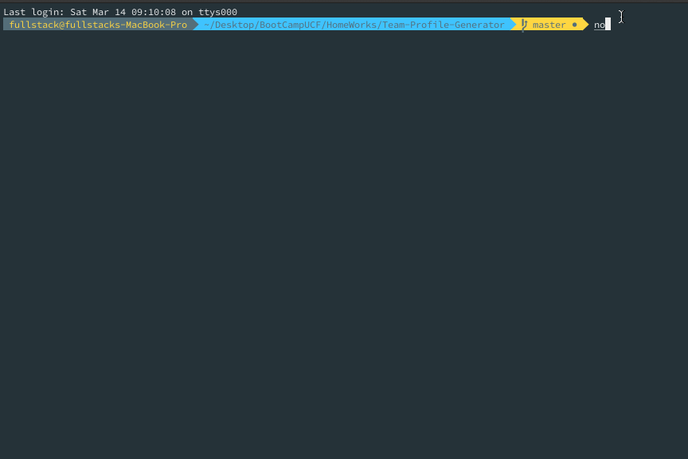

# Team Profile Generator

## Description
​
Node Command Line Interface tool, to Generate HTML site Developers Team.
​
## Table of Contents
* [Installation](#installation) 
 
* [Usage](#usage) 
 
* [License](#license) 
 
* [Contributing](#contributing) 
 
* [Tests](#tests) 
 
* [Questions](#questions) 
 

## Installation
​
To install necessary dependencies, run the following command:
​
npm install
​
## Usage
​
Is a team generator profile and export to HTML
​
## License
​
This project is licensed under the MIT license.
  
## Contributing
​
[FullStackable]('https://github.com/FullStackable') 

## Tests
​
To run tests, run the following command:
​
node app.js and follow the instructions
​
## Questions
​

​
If you have any questions about the repo, open an issue or contact [FullStackable](https://github.com/FullStackable) directly at .

